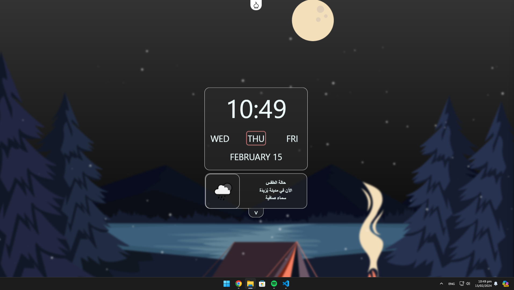
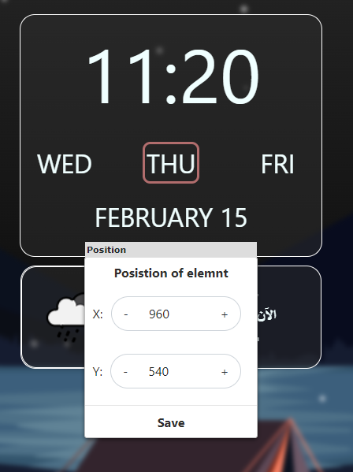
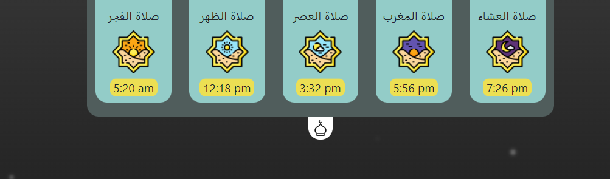

# Real-Time Background

Background that is linked with [Openweather](https://openweathermap.org/) using API and it's build to be used in [Wallpaper Engine](https://www.wallpaperengine.io/en). So, the wallpaper will take effect of any changes in the weather.

## Features

- Prayer Time
- Dragable objects
- Current weather status


## Usage
| Action | Description|
| :-: | :-: |
| Double click | Reset the object location |
| Ctrl + Left click | Open context menu |

## How to use it
First of all you need to have API KEY from [OpenWeather](https://openweathermap.org/).
Get your key then open [api.js](./js/api.js) file then Replace "YOUR_API_KEY" with your key.<br>

Key must be in this form:<br>
```
http://api.openweathermap.org/data/2.5/weather?q=[CITY_NAME],[COUNTRY_CODE]&units=metric&lang=[LANGUAGE]&appid=[YOUR_ID]
```
## Libraries
Libraries used in this project:
| Library | Description| link |
| :-:   | :-: | :-: |
| Jquery-confirm | alerts, confirms and dialogs | https://github.com/craftpip/jquery-confirm |
| Jquery-ui | user interface interactions, effects, widgets, and themes built on top of jQuery | http://jqueryui.com | 
| particles.js | A lightweight JavaScript library for creating particles | https://github.com/VincentGarreau/particles.js | 
| jQuery-contextMenu | management facility for context menus | https://github.com/swisnl/jQuery-contextMenu | 
| PrayTimes.js | Calculate prayer time | http://praytimes.org | 


## Screenshots

#### Edit Menu

#### Prayer Time Menu
